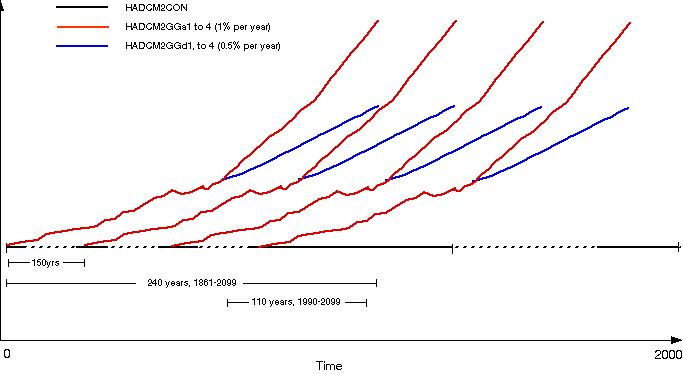

 

 <h1 align="center">HadCM2 GCM Model Information </h1>
 

 <!-- End of Page Title Block -->
 
 
 <!-- Insert Model Info Here -->
 
<B>Background Information</B>

 
 
The experiments performed at the Hadley Centre 
 used the Unified Model (Cullen, 1993). These experiments represented
 a large step forward in the way that climate change was modelled by
 GCMs and raised new possibilities for scenario construction. This
 experiment overcame some of the major difficulties that were
 associated with the previous generations of equilibrium (circa
 IPCC 1990) and cold-start transient (circa IPCC 1992) climate
 change experiments.

 
 
HadCM2 has a spatial resolution of <A HREF="hadcm2_landsea.html">2.5&deg;
 x 3.75&deg; (latitude by longitude) </A>and the representation
 produces a grid box resolution of 96 x 73 grid cells. This produces
 a surface spatial resolution of about 417km x 278 km reducing
 to 295 x 278km at 45 degrees North and South (comparable to a
 spectral resolution of T42).

 
 
The equilibrium climate sensitivity (DT2x) of HadCM2, that is the global-mean temperature
 response to a doubling of effective CO2
 concentration, is approximately 2.5&deg;C, although, this quantity
 varies with the time-scale considered. This is somewhat lower
 than most other GCMs (IPCC, 1992).

 
 
In order to undertake a 'warm-start' experiment it is necessary
 to perturb the model with a forcing from an early historical era,
 when the radiative forcing was relatively small compared to the
 present. The Hadley Centre started their experiments performed
 with HadCM2 with forcing from the middle industrial era, about
 1860 (Mitchell <I>et al</I>., 1995; Johns <I>et al</I>., 1995).

 
 
The greenhouse gas only integrations, HadCM2GG, used the combined
 forcing of all the greenhouse gases as an equivalent CO2
 concentration. A further series of integrations, HadCM2GS, used
 the combined equivalent CO2 concentration
 plus the negative forcing from sulphate aerosols. The HadCM2GG
 integrations simulated the change in forcing of the climate system
 by greenhouse gases since the early industrial period (taken by
 HadCM2 to be 1860). The addition of the negative forcing effects
 of sulphate aerosols represents the direct radiative forcing due
 to anthropogenic sulphate aerosols by means of an increase in
 clear-sky surface albedo proportional to the local sulphate loading
 (refer to Mitchell <I>et al</I>., 1995 for details of this method).
 The indirect effects of aerosols were not simulated.

 
 
The modelled control climate shows a negligible long term trend
 in surface air temperature over the first 400 years. The trend
 is about +0.04&deg;C per century, which is comparable to other
 such experiments. HadCM2CON represents an improvement over previous
 generations of GCMs that have been used at the Hadley Centre (Johns
 <I>et al</I>., 1995; and Airey <I>et al</I>.,1995).

 
 
The experiments performed have simulated the observed climate
 system using estimated forcing perturbations since 1860. Johns<I> et al</I>.,
 (1995) and Mitchell <I>et al</I>., (1995) have established
 that HadCM2's sensitivity is consistent with the real climate
 system. The agreement between the observed global-mean temperature
 record and that produced in these experiments is better for HadCM2GS
 than for HadCM2GG. This implies that HadCM2Gs has captured the
 observed signal of global-mean temperature changes better than HadCM2GG for
 the recent 100-year record.

 
 
&nbsp;

 
 
<b>HadCM2 Integrations</b>

 
 
The following gives a list of the climate change integrations
 that have been performed using HadCM2:

 
 <UL>
 <LI>HadCM2GGa1, to 4: an ensemble of Greenhouse Gas Integrations
 (historic equivalent GG 1860 - 1989, 1% compound increase GG
 1990 - 2099). 
 The different members of the ensembles are: 
 HadCM2GGa1 Greenhouse gas 1% forcing Member1 (the original HadCM2GG); 
 HadCM2GGa2 Greenhouse gas 1% forcing Member2; 
 HadCM2GGa3 Greenhouse gas 1% forcing Member3; 
 HadCM2GGa4 Greenhouse gas 1% forcing Member4.</LI>
 
 <LI>HadCM2GGd1 to 4, an ensemble of Greenhouse Gas Integrations
 (historic equivalent GG 1860 - 1989, 0.5% compound increase GG
 1990 - 2099). 
 The different members of the ensembles are: 
 HadCM2GGd1 Greenhouse gas 0.5% forcing Member1; 
 HadCM2GGd2 Greenhouse gas 0.5% forcing Member2; 
 HadCM2GGd3 Greenhouse gas 0.5% forcing Member3; 
 HadCM2GGd4 Greenhouse gas 0.5% forcing Member4. </LI>
 
 <LI>HadCM2GSa1 to 4: an ensemble of Greenhouse Gas plus Sulphate
 Aerosol Integrations (GGa forcing plus historic SO4
 1860 - 1989, IS92a SO4 1990 - 2099). 
 The different members of the ensembles are: 
 HadCM2GSa1 Greenhouse and Sulphate 1% forcing Member1 (the original HadCM2GS); 
 HadCM2GSa2 Greenhouse and Sulphate 1% forcing Member2; 
 HadCM2GSa3 Greenhouse and Sulphate 1% forcing Member3; 
 HadCM2GSa4 Greenhouse and Sulphate 1% forcing Member4. </LI>
 
 <LI>HadCM2GSd1 to 4: an ensemble of Greenhouse Gas plus Sulphate
 Aerosol Integrations (GGd forcing plus historic SO4
 1860 - 1989, IS92d SO4 1990 - 2099). 
 The different members of the ensembles are: 
 HadCM2GSd1 Greenhouse and Sulphate 0.5% forcing Member1; 
 HadCM2GSd2 Greenhouse and Sulphate 0.5% forcing Member2; 
 HadCM2GSd3 Greenhouse and Sulphate 0.5% forcing Member3; 
 HadCM2GSd4 Greenhouse and Sulphate 0.5% forcing Member4. </LI>
 </UL>
 
 

 
 
<B>Conceptual structure of the experimental design of the HadCM2 ensembles experiments</B>

 
 

 
 
<B>Global-Mean Temperature, Precipitation and CO2 Changes
 (w.r.t. 1961 - 1990) for the HadCM2 integrations</B>

 
 <TABLE WIDTH="95%" BORDER="1" align="center" CELLPADDING="0" CELLSPACING="2">
 <TR>
 <td ROWSPAN="2" ></TD>
 <td COLSPAN="4" align="center">2020s</TD>
 <td COLSPAN="4" align="center">2050s</TD>
 <td COLSPAN="4" align="center">2080s</TD>
 </TR>
 <TR>
 <td ALIGN="CENTER" HEIGHT="34" WIDTH="8%">DT
  (&deg;C)</td>
 <td ALIGN="CENTER" WIDTH="8%" HEIGHT="34">DP (%)</td>
 <td ALIGN="CENTER" WIDTH="8%" HEIGHT="34">DSL (cm)</td>
 <td ALIGN="CENTER" WIDTH="8%" HEIGHT="34">CO2
  (ppmv) *</td>
 <td ALIGN="CENTER" WIDTH="8%" HEIGHT="34">DT (&deg;C)</td>
 <td ALIGN="CENTER" WIDTH="8%" HEIGHT="34">DP (%)</td>
 <td ALIGN="CENTER" WIDTH="8%" HEIGHT="34">DSL
  (cm)</td>
 <td ALIGN="CENTER" WIDTH="8%" HEIGHT="34">CO2
  (ppmv) *</td>
 <td ALIGN="CENTER" WIDTH="8%" HEIGHT="34">DT
  (&deg;C)</td>
 <td ALIGN="CENTER" WIDTH="8%" HEIGHT="34">DP
  (%)</td>
 <td ALIGN="CENTER" WIDTH="8%" HEIGHT="34">DSL
  (cm)</td>
 <td ALIGN="CENTER" WIDTH="8%" HEIGHT="34">CO2
  (ppmv) *</td>
 </TR>
 <TR>
 <td HEIGHT="17" WIDTH="8%">GGa1</TD>
 <td HEIGHT="17" WIDTH="8%">
 
1.21
</td>
 <td HEIGHT="17" WIDTH="8%">
 
2.2
</td>
 <td HEIGHT="17" WIDTH="8%">
 
12.4
</td>
 <td HEIGHT="17" WIDTH="8%">
 
447
</td>
 <td HEIGHT="17" WIDTH="8%">
 
2.10
</td>
 <td HEIGHT="17" WIDTH="8%">
 
3.5
</td>
 <td HEIGHT="17" WIDTH="8%">
 
24.8
</td>
 <td HEIGHT="17" WIDTH="8%">
 
554
</td>
 <td HEIGHT="17" WIDTH="8%">
 
3.17
</td>
 <td HEIGHT="17" WIDTH="8%">
 
5.18
</td>
 <td HEIGHT="17" WIDTH="8%">
 
41.1
</td>
 <td HEIGHT="17" WIDTH="8%">
 
697
</td>
 </TR>
 <TR>
 <td HEIGHT="17" WIDTH="8%">GGa2</TD>
 <td HEIGHT="17" WIDTH="8%">
 
1.20
</td>
 <td HEIGHT="17" WIDTH="8%">
 
2.1
</td>
 <td HEIGHT="17" WIDTH="8%">
 
12.6
</td>
 <td HEIGHT="17" WIDTH="8%">
 
447
</td>
 <td HEIGHT="17" WIDTH="8%">
 
2.02
</td>
 <td HEIGHT="17" WIDTH="8%">
 
3.3
</td>
 <td HEIGHT="17" WIDTH="8%">
 
24.6
</td>
 <td HEIGHT="17" WIDTH="8%">
 
554
</td>
 <td HEIGHT="17" WIDTH="8%">
 
3.03
</td>
 <td HEIGHT="17" WIDTH="8%">
 
4.77
</td>
 <td HEIGHT="17" WIDTH="8%">
 
40.6
</td>
 <td HEIGHT="17" WIDTH="8%">
 
697
</td>
 </TR>
 <TR>
 <td HEIGHT="17" WIDTH="8%">GGa3</TD>
 <td HEIGHT="17" WIDTH="8%">
 
1.16
</td>
 <td HEIGHT="17" WIDTH="8%">
 
1.9
</td>
 <td HEIGHT="17" WIDTH="8%">
 
13.0
</td>
 <td HEIGHT="17" WIDTH="8%">
 
447
</td>
 <td HEIGHT="17" WIDTH="8%">
 
2.06
</td>
 <td HEIGHT="17" WIDTH="8%">
 
3.4
</td>
 <td HEIGHT="17" WIDTH="8%">
 
25.5
</td>
 <td HEIGHT="17" WIDTH="8%">
 
554
</td>
 <td HEIGHT="17" WIDTH="8%">
 
3.07
</td>
 <td HEIGHT="17" WIDTH="8%">
 
4.80
</td>
 <td HEIGHT="17" WIDTH="8%">
 
41.6
</td>
 <td HEIGHT="17" WIDTH="8%">
 
697
</td>
 </TR>
 <TR>
 <td HEIGHT="17" WIDTH="8%">GGa4</TD>
 <td HEIGHT="17" WIDTH="8%">
 
1.20
</td>
 <td HEIGHT="17" WIDTH="8%">
 
2.0
</td>
 <td HEIGHT="17" WIDTH="8%">
 
12.7
</td>
 <td HEIGHT="17" WIDTH="8%">
 
447
</td>
 <td HEIGHT="17" WIDTH="8%">
 
2.03
</td>
 <td HEIGHT="17" WIDTH="8%">
 
3.2
</td>
 <td HEIGHT="17" WIDTH="8%">
 
25.3
</td>
 <td HEIGHT="17" WIDTH="8%">
 
554
</td>
 <td HEIGHT="17" WIDTH="8%">
 
3.01
</td>
 <td HEIGHT="17" WIDTH="8%">
 
4.74
</td>
 <td HEIGHT="17" WIDTH="8%">
 
41.4
</td>
 <td HEIGHT="17" WIDTH="8%">
 
697
</td>
 </TR>
 <TR>
 <td HEIGHT="17" WIDTH="8%">GGaX</TD>
 <td HEIGHT="17" WIDTH="8%">
 
&nbsp;1.19
</td>
 <td HEIGHT="17" WIDTH="8%">
 
&nbsp;2.0
</td>
 <td HEIGHT="17" WIDTH="8%">
 
&nbsp;12.7
</td>
 <td HEIGHT="17" WIDTH="8%">
 
&nbsp;447
</td>
 <td HEIGHT="17" WIDTH="8%">
 
&nbsp;2.05
</td>
 <td HEIGHT="17" WIDTH="8%">
 
&nbsp;3.3
</td>
 <td HEIGHT="17" WIDTH="8%">
 
&nbsp;25.0
</td>
 <td HEIGHT="17" WIDTH="8%">
 
&nbsp;554
</td>
 <td HEIGHT="17" WIDTH="8%">
 
&nbsp;3.01
</td>
 <td HEIGHT="17" WIDTH="8%">
 
4.87
</td>
 <td HEIGHT="17" WIDTH="8%">
 
&nbsp;41.1
</td>
 <td HEIGHT="17" WIDTH="8%">
 
697
</td>
 </TR>
 <TR>
 <td HEIGHT="17" WIDTH="8%">&nbsp;</TD>
 <td HEIGHT="17" WIDTH="8%">&nbsp;</TD>
 <td HEIGHT="17" WIDTH="8%">&nbsp;</TD>
 <td HEIGHT="17" WIDTH="8%">&nbsp;</TD>
 <td HEIGHT="17" WIDTH="8%">&nbsp;</TD>
 <td HEIGHT="17" WIDTH="8%">&nbsp;</TD>
 <td HEIGHT="17" WIDTH="8%">&nbsp;</TD>
 <td HEIGHT="17" WIDTH="8%">&nbsp;</TD>
 <td HEIGHT="17" WIDTH="8%">&nbsp;</TD>
 <td HEIGHT="17" WIDTH="8%">&nbsp;</TD>
 <td HEIGHT="17" WIDTH="8%">&nbsp;</TD>
 <td HEIGHT="17" WIDTH="8%">&nbsp;</TD>
 <td HEIGHT="17" WIDTH="8%">&nbsp;</TD>
 </TR>
 <TR>
 <td HEIGHT="17" WIDTH="8%">GSa1</TD>
 <td HEIGHT="17" WIDTH="8%">
 
0.94
</td>
 <td HEIGHT="17" WIDTH="8%">
 
1.4
</td>
 <td HEIGHT="17" WIDTH="8%">
 
8.2
</td>
 <td HEIGHT="17" WIDTH="8%">
 
447
</td>
 <td HEIGHT="17" WIDTH="8%">
 
1.58
</td>
 <td HEIGHT="17" WIDTH="8%">
 
2.2
</td>
 <td HEIGHT="17" WIDTH="8%">
 
16.9
</td>
 <td HEIGHT="17" WIDTH="8%">
 
554
</td>
 <td HEIGHT="17" WIDTH="8%">
 
2.58
</td>
 <td HEIGHT="17" WIDTH="8%">
 
3.87
</td>
 <td HEIGHT="17" WIDTH="8%">
 
29.5
</td>
 <td HEIGHT="17" WIDTH="8%">
 
697
</td>
 </TR>
 <TR>
 <td HEIGHT="17" WIDTH="8%">GSa2</TD>
 <td HEIGHT="17" WIDTH="8%">
 
0.93
</td>
 <td HEIGHT="17" WIDTH="8%">
 
1.5
</td>
 <td HEIGHT="17" WIDTH="8%">
 
8.2
</td>
 <td HEIGHT="17" WIDTH="8%">
 
447
</td>
 <td HEIGHT="17" WIDTH="8%">
 
1.54
</td>
 <td HEIGHT="17" WIDTH="8%">
 
2.2
</td>
 <td HEIGHT="17" WIDTH="8%">
 
17.1
</td>
 <td HEIGHT="17" WIDTH="8%">
 
554
</td>
 <td HEIGHT="17" WIDTH="8%">
 
2.47
</td>
 <td HEIGHT="17" WIDTH="8%">
 
3.70
</td>
 <td HEIGHT="17" WIDTH="8%">
 
30.1
</td>
 <td HEIGHT="17" WIDTH="8%">
 
697
</td>
 </TR>
 <TR>
 <td HEIGHT="17" WIDTH="8%">GSa3</TD>
 <td HEIGHT="17" WIDTH="8%">
 
0.94
</td>
 <td HEIGHT="17" WIDTH="8%">
 
1.4
</td>
 <td HEIGHT="17" WIDTH="8%">
 
8.3
</td>
 <td HEIGHT="17" WIDTH="8%">
 
447
</td>
 <td HEIGHT="17" WIDTH="8%">
 
1.61
</td>
 <td HEIGHT="17" WIDTH="8%">
 
2.4
</td>
 <td HEIGHT="17" WIDTH="8%">
 
17.3
</td>
 <td HEIGHT="17" WIDTH="8%">
 
554
</td>
 <td HEIGHT="17" WIDTH="8%">
 
2.49
</td>
 <td HEIGHT="17" WIDTH="8%">
 
3.64
</td>
 <td HEIGHT="17" WIDTH="8%">
 
29.7
</td>
 <td HEIGHT="17" WIDTH="8%">
 
697
</td>
 </TR>
 <TR>
 <td HEIGHT="17" WIDTH="8%">GSa4</TD>
 <td HEIGHT="17" WIDTH="8%">
 
0.91
</td>
 <td HEIGHT="17" WIDTH="8%">
 
1.3
</td>
 <td HEIGHT="17" WIDTH="8%">
 
8.4
</td>
 <td HEIGHT="17" WIDTH="8%">
 
447
</td>
 <td HEIGHT="17" WIDTH="8%">
 
1.50
</td>
 <td HEIGHT="17" WIDTH="8%">
 
2.1
</td>
 <td HEIGHT="17" WIDTH="8%">
 
17.3
</td>
 <td HEIGHT="17" WIDTH="8%">
 
554
</td>
 <td HEIGHT="17" WIDTH="8%">
 
2.51
</td>
 <td HEIGHT="17" WIDTH="8%">
 
3.71
</td>
 <td HEIGHT="17" WIDTH="8%">
 
30.1
</td>
 <td HEIGHT="17" WIDTH="8%">
 
697
</td>
 </TR>
 <TR>
 <td HEIGHT="17" WIDTH="8%">GSaX</TD>
 <td HEIGHT="17" WIDTH="8%">
 
&nbsp;0.92
</td>
 <td HEIGHT="17" WIDTH="8%">
 
1.4
</td>
 <td HEIGHT="17" WIDTH="8%">
 
8.3
</td>
 <td HEIGHT="17" WIDTH="8%">
 
&nbsp;447
</td>
 <td HEIGHT="17" WIDTH="8%">
 
&nbsp;1.56
</td>
 <td HEIGHT="17" WIDTH="8%">
 
&nbsp;2.2
</td>
 <td HEIGHT="17" WIDTH="8%">
 
&nbsp;17.1
</td>
 <td HEIGHT="17" WIDTH="8%">
 
&nbsp;554
</td>
 <td HEIGHT="17" WIDTH="8%">
 
&nbsp;2.51
</td>
 <td HEIGHT="17" WIDTH="8%">
 
&nbsp;3.73
</td>
 <td HEIGHT="17" WIDTH="8%">
 
&nbsp;29.9
</td>
 <td HEIGHT="17" WIDTH="8%">
 
697
</td>
 </TR>
 <TR>
 <td HEIGHT="17" WIDTH="8%">&nbsp;</TD>
 <td HEIGHT="17" WIDTH="8%">&nbsp;</TD>
 <td HEIGHT="17" WIDTH="8%">&nbsp;</TD>
 <td HEIGHT="17" WIDTH="8%">&nbsp;</TD>
 <td HEIGHT="17" WIDTH="8%">&nbsp;</TD>
 <td HEIGHT="17" WIDTH="8%">&nbsp;</TD>
 <td HEIGHT="17" WIDTH="8%">&nbsp;</TD>
 <td HEIGHT="17" WIDTH="8%">&nbsp;</TD>
 <td HEIGHT="17" WIDTH="8%">&nbsp;</TD>
 <td HEIGHT="17" WIDTH="8%">&nbsp;</TD>
 <td HEIGHT="17" WIDTH="8%">&nbsp;</TD>
 <td HEIGHT="17" WIDTH="8%">&nbsp;</TD>
 <td HEIGHT="17" WIDTH="8%">&nbsp;</TD>
 </TR>
 <TR>
 <td HEIGHT="17" WIDTH="8%">GGd1</TD>
 <td HEIGHT="17" WIDTH="8%">
 
0.98
</td>
 <td HEIGHT="17" WIDTH="8%">
 
1.8
</td>
 <td HEIGHT="17" WIDTH="8%">
 
11.5
</td>
 <td HEIGHT="17" WIDTH="8%">
 
398
</td>
 <td HEIGHT="17" WIDTH="8%">
 
1.53
</td>
 <td HEIGHT="17" WIDTH="8%">
 
2.8
</td>
 <td HEIGHT="17" WIDTH="8%">
 
21.5
</td>
 <td HEIGHT="17" WIDTH="8%">
 
443
</td>
 <td HEIGHT="17" WIDTH="8%">
 
1.95
</td>
 <td HEIGHT="17" WIDTH="8%">
 
3.53
</td>
 <td HEIGHT="17" WIDTH="8%">
 
33.0
</td>
 <td HEIGHT="17" WIDTH="8%">
 
498
</td>
 </TR>
 <TR>
 <td HEIGHT="17" WIDTH="8%">GGd2</TD>
 <td HEIGHT="17" WIDTH="8%">
 
0.84
</td>
 <td HEIGHT="17" WIDTH="8%">
 
1.5
</td>
 <td HEIGHT="17" WIDTH="8%">
 
9.5
</td>
 <td HEIGHT="17" WIDTH="8%">
 
398
</td>
 <td HEIGHT="17" WIDTH="8%">
 
1.38
</td>
 <td HEIGHT="17" WIDTH="8%">
 
2.4
</td>
 <td HEIGHT="17" WIDTH="8%">
 
18.9
</td>
 <td HEIGHT="17" WIDTH="8%">
 
443
</td>
 <td HEIGHT="17" WIDTH="8%">
 
1.92
</td>
 <td HEIGHT="17" WIDTH="8%">
 
3.36
</td>
 <td HEIGHT="17" WIDTH="8%">
 
29.8
</td>
 <td HEIGHT="17" WIDTH="8%">
 
498
</td>
 </TR>
 <TR>
 <td HEIGHT="17" WIDTH="8%">GGd3</TD>
 <td HEIGHT="17" WIDTH="8%">
 
0.88
</td>
 <td HEIGHT="17" WIDTH="8%">
 
1.6
</td>
 <td HEIGHT="17" WIDTH="8%">
 
7.6
</td>
 <td HEIGHT="17" WIDTH="8%">
 
398
</td>
 <td HEIGHT="17" WIDTH="8%">
 
1.43
</td>
 <td HEIGHT="17" WIDTH="8%">
 
2.6
</td>
 <td HEIGHT="17" WIDTH="8%">
 
17.7
</td>
 <td HEIGHT="17" WIDTH="8%">
 
443
</td>
 <td HEIGHT="17" WIDTH="8%">
 
1.97
</td>
 <td HEIGHT="17" WIDTH="8%">
 
3.45
</td>
 <td HEIGHT="17" WIDTH="8%">
 
29.2
</td>
 <td HEIGHT="17" WIDTH="8%">
 
498
</td>
 </TR>
 <TR>
 <td HEIGHT="17" WIDTH="8%">GGd4</TD>
 <td HEIGHT="17" WIDTH="8%">
 
0.98
</td>
 <td HEIGHT="17" WIDTH="8%">
 
1.7
</td>
 <td HEIGHT="17" WIDTH="8%">
 
6.2
</td>
 <td HEIGHT="17" WIDTH="8%">
 
398
</td>
 <td HEIGHT="17" WIDTH="8%">
 
1.50
</td>
 <td HEIGHT="17" WIDTH="8%">
 
2.7
</td>
 <td HEIGHT="17" WIDTH="8%">
 
15.8
</td>
 <td HEIGHT="17" WIDTH="8%">
 
443
</td>
 <td HEIGHT="17" WIDTH="8%">
 
1.94
</td>
 <td HEIGHT="17" WIDTH="8%">
 
3.48
</td>
 <td HEIGHT="17" WIDTH="8%">
 
27.0
</td>
 <td HEIGHT="17" WIDTH="8%">
 
498
</td>
 </TR>
 <TR>
 <td HEIGHT="17" WIDTH="8%">GGdX</TD>
 <td HEIGHT="17" WIDTH="8%">
 
&nbsp;0.92
</td>
 <td HEIGHT="17" WIDTH="8%">
 
&nbsp;1.7
</td>
 <td HEIGHT="17" WIDTH="8%">
 
&nbsp;6.7
</td>
 <td HEIGHT="17" WIDTH="8%">
 
&nbsp;398
</td>
 <td HEIGHT="17" WIDTH="8%">
 
&nbsp;1.46
</td>
 <td HEIGHT="17" WIDTH="8%">
 
&nbsp;2.6
</td>
 <td HEIGHT="17" WIDTH="8%">
 
&nbsp;18.5
</td>
 <td HEIGHT="17" WIDTH="8%">
 
&nbsp;443
</td>
 <td HEIGHT="17" WIDTH="8%">
 
&nbsp;1.94
</td>
 <td HEIGHT="17" WIDTH="8%">
 
&nbsp;3.46
</td>
 <td HEIGHT="17" WIDTH="8%">
 
&nbsp;29.7
</td>
 <td HEIGHT="17" WIDTH="8%">
 
&nbsp;498
</td>
 </TR>
 <TR>
 <td HEIGHT="17" WIDTH="8%">&nbsp;</TD>
 <td HEIGHT="17" WIDTH="8%">&nbsp;</TD>
 <td HEIGHT="17" WIDTH="8%">&nbsp;</TD>
 <td HEIGHT="17" WIDTH="8%">&nbsp;</TD>
 <td HEIGHT="17" WIDTH="8%">&nbsp;</TD>
 <td HEIGHT="17" WIDTH="8%">&nbsp;</TD>
 <td HEIGHT="17" WIDTH="8%">&nbsp;</TD>
 <td HEIGHT="17" WIDTH="8%">&nbsp;</TD>
 <td HEIGHT="17" WIDTH="8%">&nbsp;</TD>
 <td HEIGHT="17" WIDTH="8%">&nbsp;</TD>
 <td HEIGHT="17" WIDTH="8%">&nbsp;</TD>
 <td HEIGHT="17" WIDTH="8%">&nbsp;</TD>
 <td HEIGHT="17" WIDTH="8%">&nbsp;</TD>
 </TR>
 <TR>
 <td HEIGHT="17" WIDTH="8%">GSd1</TD>
 <td HEIGHT="17" WIDTH="8%">
 
0.74
</td>
 <td HEIGHT="17" WIDTH="8%">
 
1.0
</td>
 <td HEIGHT="17" WIDTH="8%">
 
7.9
</td>
 <td HEIGHT="17" WIDTH="8%">
 
398
</td>
 <td HEIGHT="17" WIDTH="8%">
 
1.40
</td>
 <td HEIGHT="17" WIDTH="8%">
 
2.5
</td>
 <td HEIGHT="17" WIDTH="8%">
 
15.8
</td>
 <td HEIGHT="17" WIDTH="8%">
 
443
</td>
 <td HEIGHT="17" WIDTH="8%">
 
1.84
</td>
 <td HEIGHT="17" WIDTH="8%">
 
3.23
</td>
 <td HEIGHT="17" WIDTH="8%">
 
25.4
</td>
 <td HEIGHT="17" WIDTH="8%">
 
498
</td>
 </TR>
 <TR>
 <td HEIGHT="17" WIDTH="8%">GSd2</TD>
 <td HEIGHT="17" WIDTH="8%">
 
0.76
</td>
 <td HEIGHT="17" WIDTH="8%">
 
1.3
</td>
 <td HEIGHT="17" WIDTH="8%">
 
8.9
</td>
 <td HEIGHT="17" WIDTH="8%">
 
398
</td>
 <td HEIGHT="17" WIDTH="8%">
 
1.29
</td>
 <td HEIGHT="17" WIDTH="8%">
 
2.4
</td>
 <td HEIGHT="17" WIDTH="8%">
 
16.6
</td>
 <td HEIGHT="17" WIDTH="8%">
 
443
</td>
 <td HEIGHT="17" WIDTH="8%">
 
1.77
</td>
 <td HEIGHT="17" WIDTH="8%">
 
3.16
</td>
 <td HEIGHT="17" WIDTH="8%">
 
25.7
</td>
 <td HEIGHT="17" WIDTH="8%">
 
498
</td>
 </TR>
 <TR>
 <td HEIGHT="17" WIDTH="8%">GSd3</TD>
 <td HEIGHT="17" WIDTH="8%">
 
0.84
</td>
 <td HEIGHT="17" WIDTH="8%">
 
1.4
</td>
 <td HEIGHT="17" WIDTH="8%">
 
9.5
</td>
 <td HEIGHT="17" WIDTH="8%">
 
398
</td>
 <td HEIGHT="17" WIDTH="8%">
 
1.34
</td>
 <td HEIGHT="17" WIDTH="8%">
 
2.3
</td>
 <td HEIGHT="17" WIDTH="8%">
 
17.3
</td>
 <td HEIGHT="17" WIDTH="8%">
 
443
</td>
 <td HEIGHT="17" WIDTH="8%">
 
1.81
</td>
 <td HEIGHT="17" WIDTH="8%">
 
3.17
</td>
 <td HEIGHT="17" WIDTH="8%">
 
26.6
</td>
 <td HEIGHT="17" WIDTH="8%">
 
498
</td>
 </TR>
 <TR>
 <td HEIGHT="17" WIDTH="8%">GSd4</TD>
 <td HEIGHT="17" WIDTH="8%">
 
0.81
</td>
 <td HEIGHT="17" WIDTH="8%">
 
1.3
</td>
 <td HEIGHT="17" WIDTH="8%">
 
9.5
</td>
 <td HEIGHT="17" WIDTH="8%">
 
398
</td>
 <td HEIGHT="17" WIDTH="8%">
 
1.37
</td>
 <td HEIGHT="17" WIDTH="8%">
 
2.4
</td>
 <td HEIGHT="17" WIDTH="8%">
 
17.6
</td>
 <td HEIGHT="17" WIDTH="8%">
 
443
</td>
 <td HEIGHT="17" WIDTH="8%">
 
1.87
</td>
 <td HEIGHT="17" WIDTH="8%">
 
3.37
</td>
 <td HEIGHT="17" WIDTH="8%">
 
27.2
</td>
 <td HEIGHT="17" WIDTH="8%">
 
498
</td>
 </TR>
 <TR>
 <td HEIGHT="17" WIDTH="8%">GSdX</TD>
 <td HEIGHT="17" WIDTH="8%">
 
&nbsp;0.79
</td>
 <td HEIGHT="17" WIDTH="8%">
 
&nbsp;1.3
</td>
 <td HEIGHT="17" WIDTH="8%">
 
&nbsp;8.9
</td>
 <td HEIGHT="17" WIDTH="8%">
 
&nbsp;398
</td>
 <td HEIGHT="17" WIDTH="8%">
 
&nbsp;1.35
</td>
 <td HEIGHT="17" WIDTH="8%">
 
&nbsp;2.4
</td>
 <td HEIGHT="17" WIDTH="8%">
 
&nbsp;16.8
</td>
 <td HEIGHT="17" WIDTH="8%">
 
&nbsp;443
</td>
 <td HEIGHT="17" WIDTH="8%">
 
&nbsp;1.82
</td>
 <td HEIGHT="17" WIDTH="8%">
 
&nbsp;3.23
</td>
 <td HEIGHT="17" WIDTH="8%">
 
&nbsp;26.2
</td>
 <td HEIGHT="17" WIDTH="8%">
 
&nbsp;498
</td>
 </TR>
 </TABLE>
 
 
&nbsp;

 
 
 
 

 
 <!-- end of center column -->
