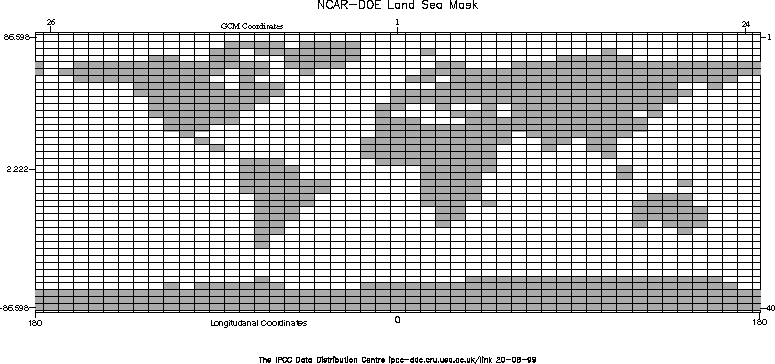

 

 <h1 align="center">NCAR-DOE GCM Land/Sea Mask</h1>
 

 <!-- End of Page Title Block -->
 
 
 <!-- Insert Land/Sea Mask Here -->
 
 
 
 

 
 
Download image as an <A HREF="ncardoe_landsea.eps">.EPS File</A>(800k) or <A HREF="ncardoe_landsea.pdf">.PDF File</A> (27k).  Alternatively, download
 the mask in <A HREF="ncardoe_landsea.txt">ASCII</A> format (3k).

 
 
&nbsp;

 
 
 
 

 
 <!-- end of center column -->
